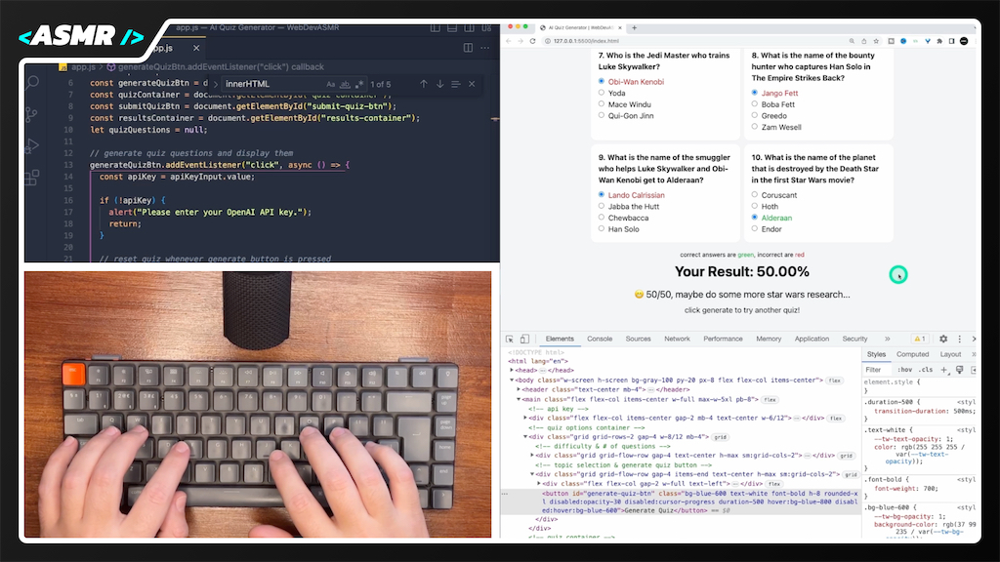

# AI Quiz Generator | WebDevASMR

Build an AI-generated quiz app using OpenAI and TailwindCSS in this programming session. Harness the power of OpenAI's API for dynamic quizzes while designing a responsive UI with TailwindCSS.

[Watch the video here:](https://www.youtube.com/watch?v=ljaYF7hgHMw?sub_confirmation=1)

